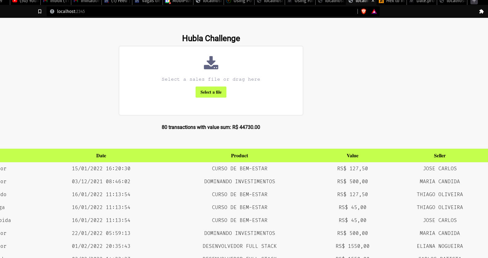

# Desafio de programação

O objetivo desse teste é avaliar as suas habilidades em programação.

## Como rodar localmente

Você precisará ter instalado em sua máquina as seguintes dependências:

```
- Go >= 1.19
- Docker
```

Feito isso basta entrar na pasta do projeto e usar o script launcher:

```
$ cd path/to/hubla-challenge
$ ./scripts/dev.sh
```

Depois basta abrir o navegador no endereço [localhost:2345](http://localhost:2345):

[](http://localhost:2345)

Você pode tanto arrastar o arquivo de transação (sales.txt) quanto selecioná-lo de seu computador.

## Descrição do projeto

Surgiu uma nova demanda urgente e precisamos de uma área exclusiva para fazer o
upload de um arquivo das transações feitas na venda de produtos por nossos
clientes.

Nossa plataforma trabalha no modelo criador-afiliado, sendo assim um criador
pode vender seus produtos e ter 1 ou mais afiliados também vendendo esses
produtos, desde que seja paga uma comissão por venda.

Sua tarefa é construir uma interface web que possibilite o upload de um arquivo
de transações de produtos vendidos, normalizar os dados e armazená-los em um
banco de dados relacional.

Você deve utilizar o arquivo [sales.txt](sales.txt) para fazer o teste da
aplicação. O formato esá descrito na seção "Formato do arquivo de entrada".

## Configurando Seu Ambiente

1. No diretório onde você descompactou o arquivo do desafio crie um repo git e
   uma branch:
   ```bash
   git init --initial-branch=main
   git checkout -b desafio
   ```
2. Desenvolva o desafio fazendo commits no repositório. 

## Requisitos Funcionais

Sua aplicação deve:

1. Ter uma tela (via formulário) para fazer o upload do arquivo
2. Fazer o parsing do arquivo recebido, normalizar os dados e armazená-los em um
   banco de dados relacional, seguindo as definições de interpretação do arquivo
3. Exibir a lista das transações de produtos importadas por produtor/afiliado,
   com um totalizador do valor das transações realizadas
4. Fazer tratamento de erros no backend, e reportar mensagens de erro amigáveis
   no frontend.

## Requisitos Não Funcionais

1. Escreva um README descrevendo o projeto e como fazer o setup.
2. A aplicação deve ser simples de configurar e rodar, compatível com ambiente
   Unix. Você deve utilizar apenas bibliotecas gratuitas ou livres.
3. Utilize docker para os diferentes serviços que compõe a aplicação para
   que funcione facilmente fora do seu ambiente pessoal.
4. Use qualquer banco de dados relacional.
5. Use commits pequenos no Git e escreva uma boa descrição para cada um.
6. Escreva unit tests tanto no backend quanto do frontend.
7. Faça o código mais legível e limpo possível.
8. Escreva o código (nomes e comentários) em inglês. A documentação pode ser em
   português se preferir.

## Requisitos Bônus

Sua aplicação não precisa, mas ficaremos impressionados se ela:

1. Tiver documentação das APIs do backend.
2. Utilizar docker-compose para orquestar os serviços num todo.
3. Ter testes de integração ou end-to-end.
4. Tiver toda a documentação escrita em inglês fácil de entender. 
5. Lidar com autenticação e/ou autorização.

## Formato do arquivo de entrada

| Campo    | Início | Fim | Tamanho | Descrição                      |
| -------- | ------ | --- | ------- | ------------------------------ |
| Tipo     | 1      | 1   | 1       | Tipo da transação              |
| Data     | 2      | 26  | 25      | Data - ISO Date + GMT          |
| Produto  | 27     | 56  | 30      | Descrição do produto           |
| Valor    | 57     | 66  | 10      | Valor da transação em centavos |
| Vendedor | 67     | 86  | 20      | Nome do vendedor               |

### Tipos de transação

Esses são os valores possíveis para o campo Tipo:

| Tipo | Descrição         | Natureza | Sinal |
| ---- | ----------------- | -------- | ----- |
| 1    | Venda produtor    | Entrada  | +     |
| 2    | Venda afiliado    | Entrada  | +     |
| 3    | Comissão paga     | Saída    | -     |
| 4    | Comissão recebida | Entrada  | +     |
